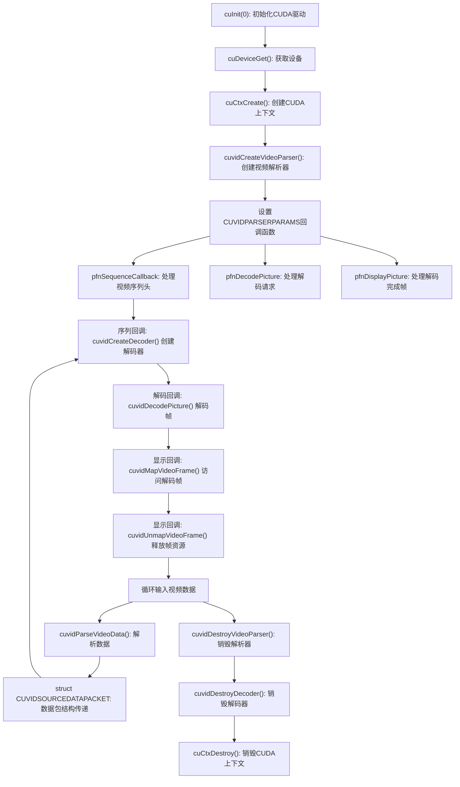

一.cuvid 的函数列表

``` shell
libvgpu#ldconfig -p | grep libnvcuvid
        libnvcuvid.so.1 (libc6,x86-64) => /lib/x86_64-linux-gnu/libnvcuvid.so.1

```

```
libvgpu#nm -D /lib/x86_64-linux-gnu/libnvcuvid.so.1 | cut -c 17- | grep -E '(Nv|cuvid)'
 T NvToolCreateInterface
 T NvToolDestroyInterface
 T NvToolGetApiFunctionCount
 T NvToolGetApiID
 T NvToolGetApiNames
 T NvToolGetInterface
 T NvToolSetApiID
 T NvToolSetInterface
 T cuvidConvertYUVToRGB
 T cuvidConvertYUVToRGBArray
 T cuvidCreateDecoder
 T cuvidCreateVideoParser
 T cuvidCreateVideoSource
 T cuvidCreateVideoSourceW
 T cuvidCtxLock
 T cuvidCtxLockCreate
 T cuvidCtxLockDestroy
 T cuvidCtxUnlock
 T cuvidDecodePicture
 T cuvidDestroyDecoder
 T cuvidDestroyVideoParser
 T cuvidDestroyVideoSource
 T cuvidGetDecodeStatus
 T cuvidGetDecoderCaps
 T cuvidGetSourceAudioFormat
 T cuvidGetSourceVideoFormat
 T cuvidGetVideoSourceState
 T cuvidMapVideoFrame
 T cuvidMapVideoFrame64
 T cuvidParseVideoData
 T cuvidPrivateOp
 T cuvidReconfigureDecoder
 T cuvidSetVideoSourceState
 T cuvidUnmapVideoFrame
 T cuvidUnmapVideoFrame64
```



二.拦截方案

基于 HAMi-core 的设计原理和 `libnvcuvid.so.1` 导出的符号表，如果要实现解码器虚拟化拦截，以下是必须拦截的关键 API：

### 必须拦截的核心 API

  1. 资源创建/初始化 API

- **`cuvidCreateVideoParser`** - 创建视频解析器，所有解码流程的起点
- **`cuvidCreateDecoder`** - 创建解码器，管理硬件解码资源
- **`cuvidCtxCreate`/`cuInit`** - CUDA 上下文创建（通过 CUDA Driver API 部分拦截）

  2. 资源管理和使用 API

- **`cuvidDecodePicture`** - 实际执行解码，消耗 GPU 计算资源
- **`cuvidMapVideoFrame`/`cuvidMapVideoFrame64`** - 访问解码后的帧内存
- **`cuvidUnmapVideoFrame`/`cuvidUnmapVideoFrame64`** - 释放帧内存
- **`cuvidParseVideoData`** - 解析视频数据并通过回调触发解码

  3. 资源查询 API

- **`cuvidGetDecoderCaps`** - 获取解码器能力，可拦截修改以控制可用特性
- **`cuvidGetDecodeStatus`** - 获取解码状态，可用于监控解码过程

### 次要但推荐拦截的 API

- **`NvToolCreateInterface`/`NvToolGetInterface`** - NVIDIA 工具接口，可能被用于获取解码器信息
- **`cuvidCtxLock`/`cuvidCtxUnlock`** - 上下文锁定，影响多线程解码
- **`cuvidReconfigureDecoder`** - 解码器重配置，影响资源使用

## 实现策略

1. **资源限制**：
   - 拦截 `cuvidCreateDecoder`，限制每个容器可创建的解码器数量
   - 在 `cuvidDecodePicture` 中实现解码时间片控制，类似 SM 限制

2. **内存控制**：
   - 通过 `cuvidMapVideoFrame` 监控和限制解码缓冲区内存使用
   - 实现帧缓存大小限制，防止单容器占用过多解码内存

3. **回调管理**：
   - 可能需要包装 `CUVIDPARSERPARAMS` 中的回调函数，在 `cuvidCreateVideoParser` 中实现

4. **监控与计量**：
   - 跟踪每个容器的解码帧数、解码时间等指标
   - 实现类似 CUDA 核心的时间片调度机制

## 实现复杂度评估

基于 HAMi-core 的 CUDA 拦截架构，实现 NVDEC 拦截相对简单，但有几个挑战：

1. 解码器内部状态复杂，需要谨慎管理状态转换
2. 视频解码是异步操作，拦截时需要考虑异步回调的处理
3. 需要理解 CUVID 回调机制，尤其是 pfnSequenceCallback、pfnDecodePicture 和 pfnDisplayPicture

总之，如同 HAMi-core 拦截 CUDA API 一样，应使用相同的 `DLSYM_HOOK_FUNC` 和动态库加载机制，定义和实现这些关键 API 的虚拟化版本。